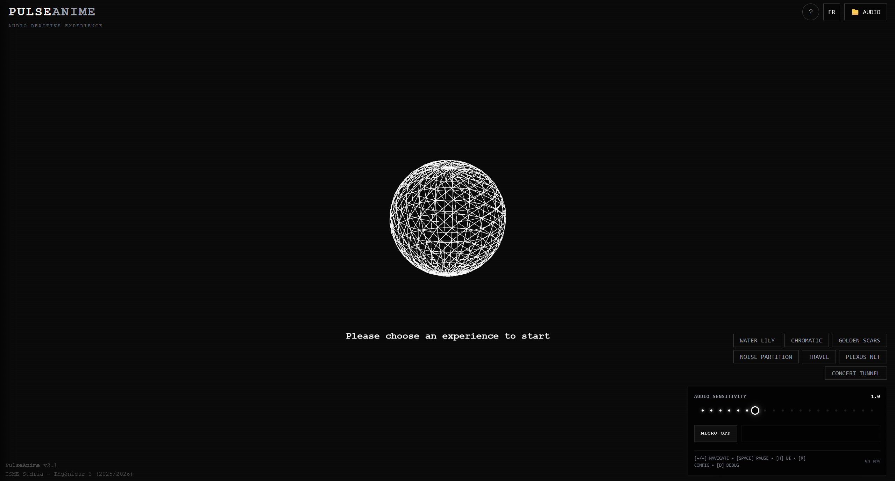

# PulseAnime — Real-time audio-reactive generative art

<p align="center">
  
</p>

[Live demo](https://pulse-anime-demo.vercel.app)

## Overview

PulseAnime is a browser-based generative art application driven by live audio analysis. It combines signal processing, the Web Audio API, TypeScript, p5.js and WebGL to turn microphone or uploaded audio into reactive visuals.

The audio engine analyzes a 4096-point FFT, separates frequency bands, detects transients and feeds several visual systems: particles, procedural L-systems, shaders and graphical distortions.

## Features

- Real-time microphone and file analysis with the Web Audio API
- 4096-point FFT, logarithmic spectrum analysis and frequency-band extraction
- Transient detection for event-driven visual reactions
- p5.js / WebGL visualizations
- Procedural L-systems, particle fields and shaders
- Controls for color, speed, sensitivity and thresholds
- Live spectrum and FPS instrumentation in the browser

## Stack

- TypeScript / JavaScript
- Vite
- p5.js / WebGL
- Web Audio API
- HTML / CSS / Tailwind CSS

## Architecture

```text
Audio input
    |
    v
Web Audio analysis
(FFT / bands / transients)
    |
    v
SketchManager
    |
    +--> p5 / WebGL sketches
    +--> particles / L-systems / shaders
    +--> spectrum + debug UI
```

The application runs entirely in the browser. Audio analysis drives the rendering loop directly; there is no backend service involved.

## Run locally

```bash
git clone https://github.com/LeBoogiepop/PulseAnime.git
cd PulseAnime
npm install
npm run dev
```

Vite will print the local development URL.

## Project structure

```text
src/
├── components/   # spectrum/debug UI
├── managers/     # sketch, settings and UI orchestration
├── services/     # audio analysis engine
├── sketches/     # p5.js / WebGL visual systems
├── utils/        # math and geometry helpers
├── types.ts
├── i18n.ts
└── index.tsx
```

## Why I built it

The project explores a simple question: how can audio analysis become an input system for visual creation rather than just a waveform display? The goal is to make signal-processing decisions visible through motion, shape and interaction in real time.
